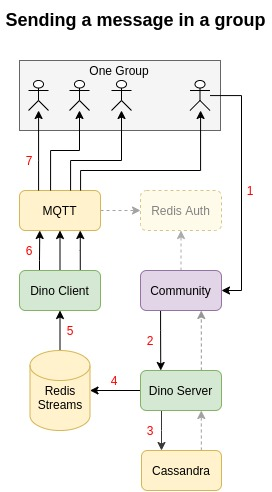

# Dino Message System

Backend service for distributed notifications using MQTT over websockets or TCP streams.



1. User sends a message in a group chat,
2. Community checks business logic and rules, then calls Dino Server REST API to save and broadcast a new message,
3. Dino Server saves the message in Cassandra,
4. Dino Server sends a broadcast request (containing a list of all user IDs that are in the group) to a Redis Stream,
5. One of the Dino Clients that is subscribing to the stream group will received the broadcast request (all nodes are 
in the same consumer group and are thus load-balanced),
6. The Dino Client sends one copy of the message to each user's MQTT topic (every user has their own topic),
7. MQTT pushes the new message to each user in the group.


## Client usage

First connect to MQTT and subscribe to your User ID topic:

```javascript
let settings = {
    clientId: '1234',
    username: '1234',
    clean: false,
    qos: 1
}
let client  = mqtt.connect('mqtt://host:port/mqtt', settings);

client.on('connect', function () {
    client.subscribe('1234', {qos: 1}, function (err) {
        if (err) {
            console.log(err);
        }
    })
});

client.on('message', function (topic, message) {
    console.log(message.toString());
});
```

Event when a group you're part of has been created or updated:

```json
{
    "event_type": "group",
    "group_id": "9d78163c-1144-485a-92c6-6015afc6cd40",
    "name": "a name",
    "created_at": 1597877421.453804,
    "updated_at": 1597877421.453804,
    "last_message_time": 1597877421.453804,
    "group_type": 0,
    "owner_id": 1234,
    "user_ids": [1234]
}
```

Event when a new message is sent to a group you're part of:

```json
{
    "event_type": "message",
    "group_id": "6cbb3265-2a7f-494d-92ad-f4503d55d49f",
    "sender_id": 1234,
    "message_id": "c87efd18-8879-4c24-8b26-ccb7f40a0fe5",
    "message_payload": "test message from rest api",
    "message_type": "text",
    "created_at": 1597877384.794828
}
```

test